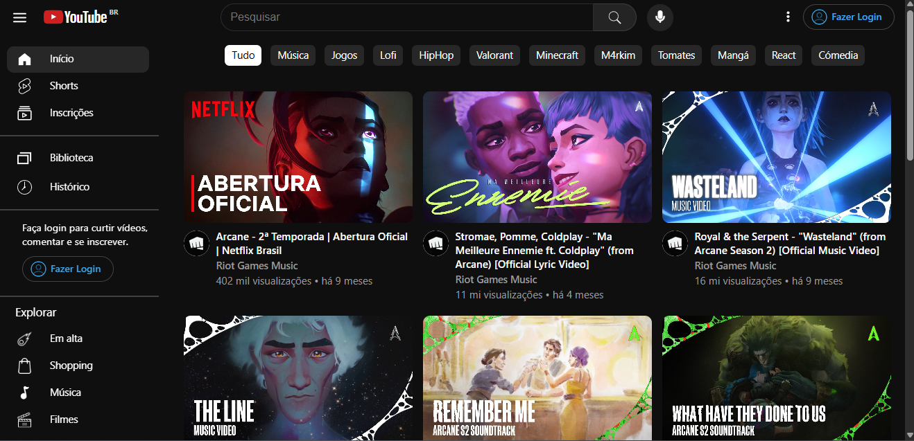
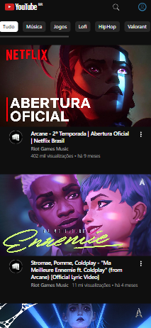
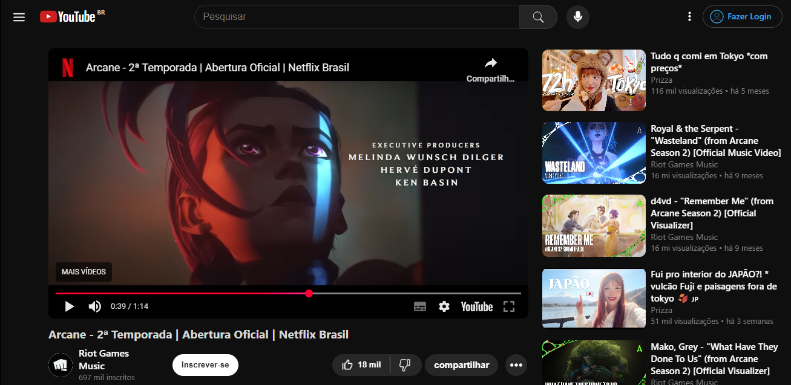

# YouTube Clone

## 📋 Sobre o Projeto

O **YouTube Clone** é uma aplicação front-end que recria a experiência de navegação e visualização de vídeos do YouTube. O projeto demonstra o uso de React e React Router para construir uma interface de usuário interativa, responsiva e com navegação dinâmica entre páginas.

### Tela Inicial

  
  &nbsp;
  

### Tela de Vídeo

  
  &nbsp;
  

## 🚀 Tecnologias Utilizadas

Este projeto foi construído com as seguintes tecnologias:

- **[React](https://react.dev/):** Biblioteca principal para a construção da interface de usuário.
- **[React Router](https://reactrouter.com/):** Para o gerenciamento de rotas e navegação.
- **CSS Modules:** Para estilização de componentes de forma escopada.
- **JavaScript (ES6+):** Linguagem base da aplicação.
- **HTML5 & CSS3:** Para estruturação e estilização.

## 🔗 Link para Visualização

Você pode acessar o projeto em produção através deste link:
[https://youtube-clone-tenshi.vercel.app](https://youtube-clone-tenshi.vercel.app)
